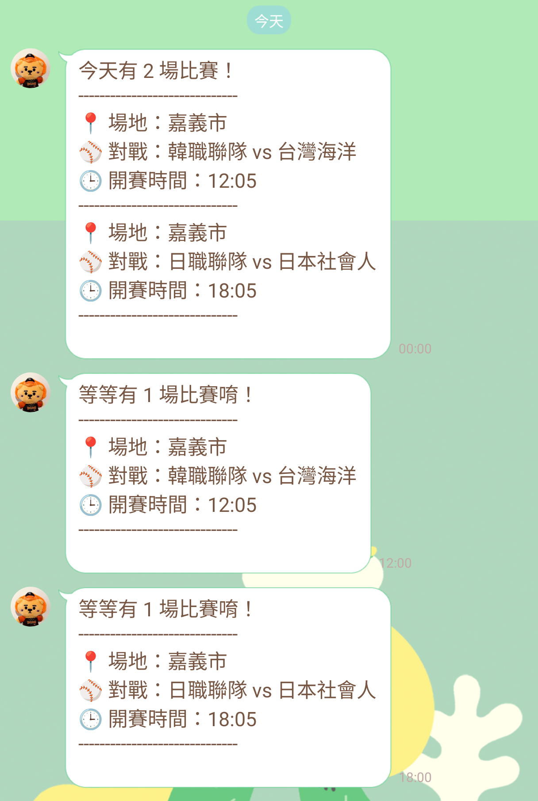

# CPBL 今日賽事通知（LINE Bot）  

## 功能摘要  

1. 自動抓取 CPBL 今日賽事資訊 
   程式會從中華職棒 [CPBL 官網](https://awb.cpbl.com.tw/) 
 取得當日所有賽事，包含：
   - 比賽場地
   - 對戰組合
   - 開賽時間

2. **透過 LINE BOT 發送提醒通知**
   - **每日凌晨 00:00** 推播當日賽事資訊
   - **開賽前 5 分鐘**再發送一次提醒通知

## 使用方法

1. 將自己的 **LINE BOT Channel Access Token** 設定為環境變數（TOKEN）
2. 使用 **Google Cloud Scheduler + Cloud Functions** 進行定時呼叫並執行程式

## 更新日期
2025-11-20

目前以冬季聯盟資料為主，例行賽開始前會再進行更新

## 截圖範例
以下為 LINE Bot 推播示意圖

